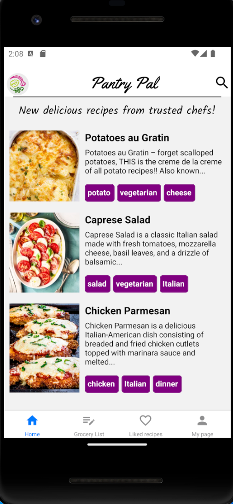

# PantryPal - The innovative recipe app

<div align="center">
  
</div>


### Projects purpose:

PantryPal is the innovative recipe app developed using React Native with the Expo framework. The app provides the functionality for the users to add recipies to their grocerylist to easen their shopping.

### Planning:
Rough layout and logical mindmap was constructed in Excalidraw to easen the projects scope and to make an clear overhead view what key components was needed for the entire project to function.

### Features:
- <b>Grocery List:</b> Users can add recipes to their grocery list, making shopping more efficient.
- <b>Search Functionality:</b> Enables users to search for recipes based on ingredients, names, or tags.
- <b>User Authentication:</b> Supports secure user sign-in and sign-up.
- <b>Modal Interactions:</b> Utilizes Modals for enhanced user interactions, such as adding recipes and viewing details.


### Backend:
For the backend component of PantryPal, please visit the [PantryPal-Server repository](https://github.com/Jonathannilsson90/PantryPal-Server).

### Key takeaways:
Throughout the development of this project, I had the opportunity to explore and understand various aspects of the technology stack and app development process. Some of the valuable insights I gained include:

- Utiziling Android Studios for development and debugging.
- Implementing AsyncStoreage to store tokens recieved by the backend.
- Leveraging how specific modules work such as Modals,FlatLists, Pressable, onPress, onClose and much more!
- Understanding how stylesheets work in React Native to make consistant and visually appealing designs.
- Gaining basic knownledge about the difference between pages and screens and how they behave differently.

## Getting Started

To run the PantryPal app locally, follow these steps:

1. Clone this repository.
2. Install dependencies using `npm install`.
3. Configure envirmont variables in a `.env` file.
4. Run the app using `expo start`

## Environment variables
```
API_URL
```

### License
This project is licensed under the [MIT License](LICENSE).
